:title: Spinnaker & K8s
:author: Thomas A. McGonagle
:keywords: Spinnaker, k8s, kubernetes, helm
:skip-help: true
:css: presentation.css

.. header::
    .. image:: images/Armory_logo.gif 
        :height: 300px
        :width: 600px
        :align: center
        :target: https://armory.io

.. footer::
    .. image:: images/spinnaker.png 
        :height: 70px
        :width: 90px
        :align: center
        :target: https://www.spinnaker.io/

    

----

:id: title-slide

Spinnaker & K8s
===============
9/23/19 - 9/26/19
-----------------

.. note::

  * Introductory Slide.

----

:id: agenda

Agenda
======

* Intro, Goals, Assumptions
* Background & Philosophy & Terminology
* Docker and Kubernetes Overview
* Spinnaker Archtecture Overview
* Creating a Spinnaker Application

.. note::
    * Agenda overview for training.

----

:id: agenda-cont

Agenda cont.
=============

* Introductions to Pipelines
* Working with Helm
* Pipeline Strategies
* Introduction to Spring Expression Language (SpEL)
* Deploying Stateful Applications
* Debugging Pipelines

.. note::
    * Agenda overview continued for training. 

----

:id: who-am-i

/usr/bin/whoami
===============
Thomas A. McGonagle
-------------------
Solutions Architect
-------------------
thomas.mcgonagle@armory.io
--------------------------
https://go.armory.io/thomas
---------------------------

.. note::
  * Introduction to the instructor. 

----

:id: intro

Introductions
===================

* Name

* Role

* Favorite Terrible Movie 

.. note::

  * Class room introductions and an icebreaker. 

----

:id: spinnaker-metaphor

Spinnaker Metaphor
========================

.. image:: images/waterworld.jpg 
    :height: 600px
    :width: 400px

.. note::
  * A spinnaker is a parachute used in sailing which catches the wind and allows a sail boat to travel faster. 
    This is the metaphor for Spinnaker the CD tool. It is an extra sail that allows your cloud deployments to go 
    faster. There is a famous spinnaker scene in the awesomely terrible waterworld movie where the protagonist
    shoots a spinnaker out of his boat to escape the smokers. 

----

:id: training-goals

Training Goals
==============

* Grok Spinnaker & K8s

* ??

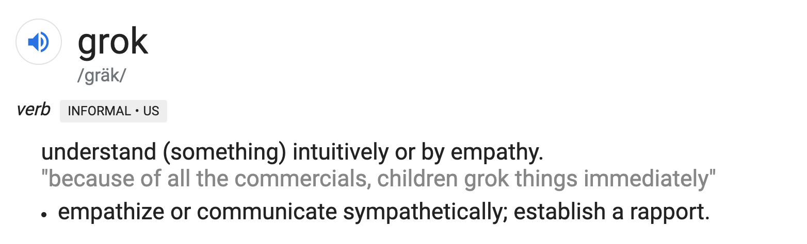

.. note::

  * The goal of the training is for the student to develop a better general overall understanding of Spinnaker
    specifically and continuos delivery in general.

----

:id: workshop-philosophy

Training Philosophy
===================

.. note::
  * My grandfather was a high school history teacher for 35 years. He always said that the best teaching
    he ever experienced was in the army. Where they TELL you what they are going to teach you, TEACH it, and the
    TEST you on it. 
    In addition, the class is meant to be interactive and conversational. Similar to the socratic method.

----

:id: learning-fun 

Fun Learning Strategies
=======================

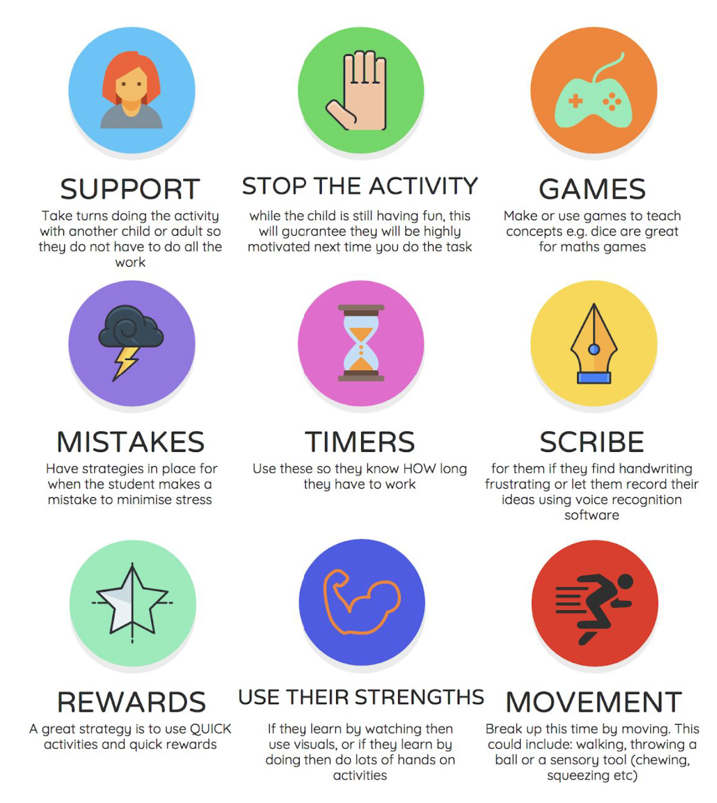

.. note::
  * The class is meant to be friendly to all sorts of learning styles and for it to be fun!

----

:id: devops-tenants

DevOps Tenants - ACAMS+
=======================

* Agile
* Culture
* Automation
* Metrics
* Sharing
* Plus...

.. note::
    * The tenants of DevOps a dicussion on each tenant. 

----

:id: devops-practices

DevOps Practices
=======================

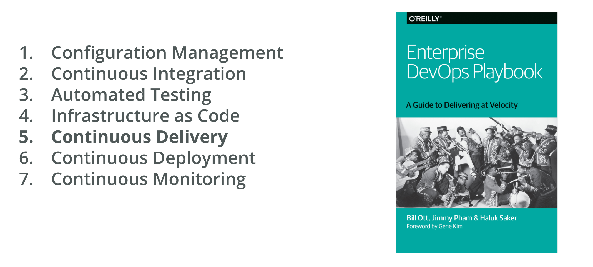

.. note::
    * A discussion of the 7 practices of DevOps and the excellent book Enterprise DevOps Playbook. 

----

:id: ci-cd

CI/CD
=====

.. image:: https://www.talend.com/wp-content/uploads/DevOps-Talend-1.png
    :height: 600px
    :width: 1200px
    :align: center

.. note::
    * A discussion of continuous integration and delivery.

----

:id: continuous-improvement 

Continuous Improvement
======================

.. image:: https://www.planview.com/wp-content/uploads/2018/09/what-is-continuous-improvement-leankit.jpg
    :height: 600px
    :width: 1000px
    :align: center

.. note::
    * This presentation was created through the principles of continuous improvement. What made it possible?
      This presentation is a software project. Changes made to this presenation are pushed to GitHub, which
      then kicks off a docker build, which subsequently kicks off a pipeline in Spinnaker. This mimics the process
      at netflix and other big companies where they make hundreds if not thousands of deployments a day. 

----

:id: three-ways

Three Ways
==========

.. image:: images/three_ways.png 
    :height: 600px
    :width: 1200px
    :align: center

.. note::
    * The third way of DevOps is "continued experimentation" in order to learn from mistakes and achieve mastery. 
        This is the goal of DevOps mastery. Mastery of the people, processes and tools in your environment. 
        Mastery is only possible through experimentation and trying new things. 

----

:id: hovercaft

hovercraft
==========

.. image:: https://www.hoverstream.com/wp-content/uploads/2016/01/Marlin-II_Main.png
    :height: 600px
    :width: 600px
    :align: center 
    :target: https://hovercraft.readthedocs.io/en/latest/index.html

.. note::
    * Hovercraft is a python based presentation tool we use to craft our presentations. It relies on restructured text
        documents that are rendered into an HTML presetnation. We manage our presentation proejects with software development
        tools such as GitHub and Spinnaker, because our presentations are software. Managing it in this way allows us to use
        continuous experimentation, continuous improvement and continuous delivery. 

----

:id: dog-food

Dog Food
========

.. image:: https://images-na.ssl-images-amazon.com/images/I/81XPwF8NnAL._SL1500_.jpg
    :height: 600px
    :width: 800px
    :align: center

.. note::
    * Dog Food is an old MicroSoft expression that means using your software to create your software. Essentially
        eating your own dog food. We are dog fooding our presentation software by having it enabled in a CI/CD pipeline to deliver. 

----

:id: instrument 

Play your Computer Like an Instrument
=====================================

.. image::  https://cdn.shopify.com/s/files/1/0182/0563/products/MaestroVNTop_682x1800_7159c927-5752-43e0-9c2e-a19df87bf18b_800x.JPG?v=1551819005
    :height: 600px
    :width: 600px

.. note::
  * At Armory we believe that as professionals we should be using our computers as if they were a musical instrument. And that we should be
    "making music" with our computers. I personally love this metaphor and want to communicate the workflows that I find most powerful and want
    to level up our 

----

:id: docker-desktop

Docker Desktop
==============

.. image:: https://www.docker.com/sites/default/files/d8/styles/large/public/2019-08/docker_desktop_enterprise_image.jpg?itok=KmkLTRBv
    :height: 600px
    :width: 800px
    :align: center 
    :target: https://www.docker.com/products/docker-desktop

.. note::
    * Docker produces a very good Docker development environment for macs and windows servers called Docker Desktop. Download it to build and manage a
        docker container. 

----

:id: github-desktop

GitHub Desktop
==============

.. image:: https://desktop.github.com/images/github-desktop-screenshot-mac.png 
    :height: 600px
    :width: 800px
    :align: center 
    :target: https://desktop.github.com/ 

.. note::
    * Git is a revolutionary version control system. GitHub makes social coding possible. The GitHub desktop tool clarifies much of the GitHub workflow and 
      and it is a suggested tool in your tool box. 

----

:id: visual-studio-code

Visual Studio Code
==================

.. image:: https://upload.wikimedia.org/wikipedia/commons/thumb/9/9a/Visual_Studio_Code_1.35_icon.svg/1200px-Visual_Studio_Code_1.35_icon.svg.png
    :height: 600px
    :width: 600px
    :align: center 
    :target: https://code.visualstudio.com/

.. note::
    * Visual Studio Code, available for Windows and Mac is a great Integrated Development Environment, supporting many differnt languages and plugins. 

----

:id: homebrew

Home Brew
=========

.. image:: https://upload.wikimedia.org/wikipedia/commons/thumb/9/95/Homebrew_logo.svg/1200px-Homebrew_logo.svg.png
    :height: 600px
    :width: 600px
    :align: center 
    :target: https://brew.sh/

.. note::
    * Homebrew is the package manager of choice for Mac desktops. Its the source of many command line tools. 

----

:id: brew-install

brew install
============

.. code:: python

   brew install git

   brew install kubernetes-helm

   brew install kubectx

.. note::
    * Make sure to have git installed, kubernetes-helm and kubectx

----

:id: docker-transition

Docker
======

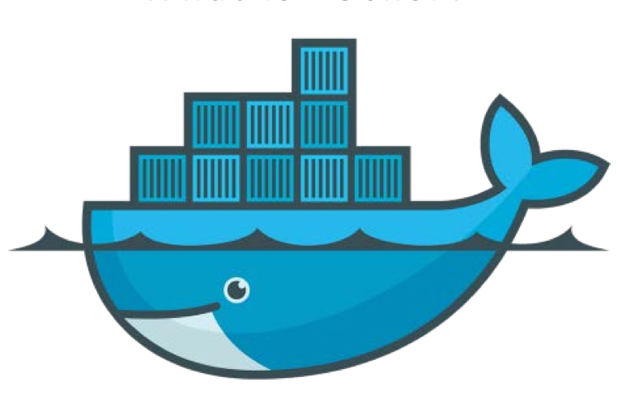

.. note::
    * Docker transition slide

----

:id: what-is-docker

What is Docker?
===============

* Ligthweight, open, secure platform
* Simplify building, shipping, and running apps
* Runs natively on Linux, Mac or Windows Server
* Relies on "images" and "containers"

.. note::
    * Overview of Docker

----

:id: what-is-a-container

What is a container?
====================

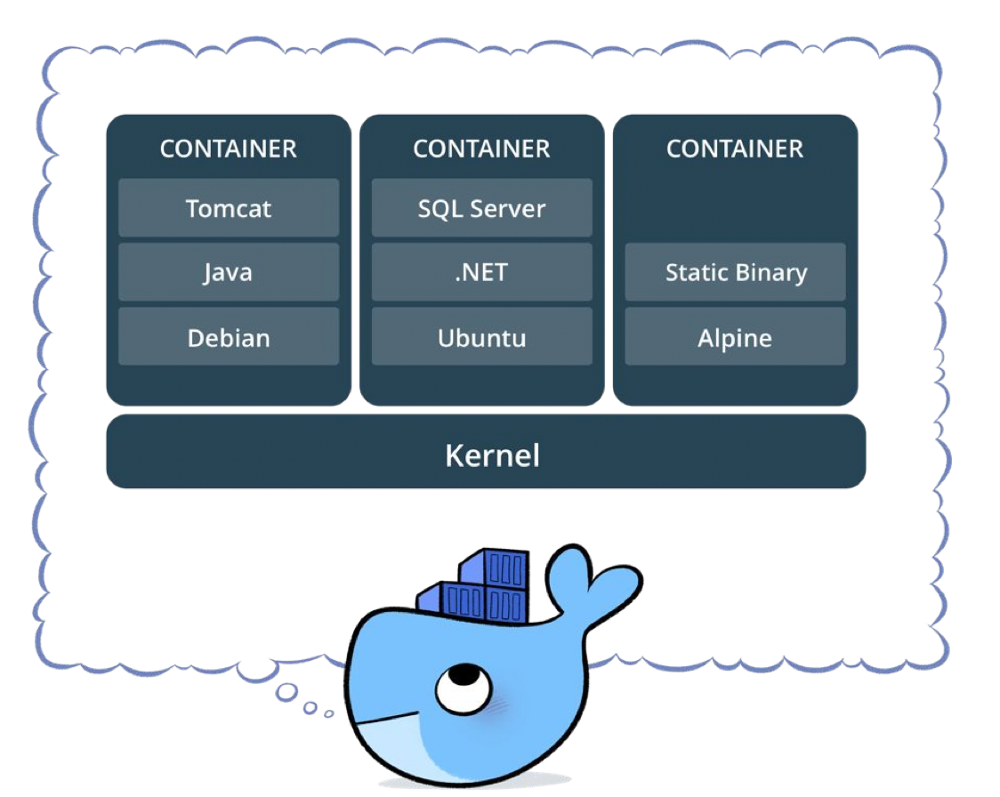

.. note::
    * Overview of a container

----

:id: docker-vs-vms

Docker vs. Virtual Machines
===========================

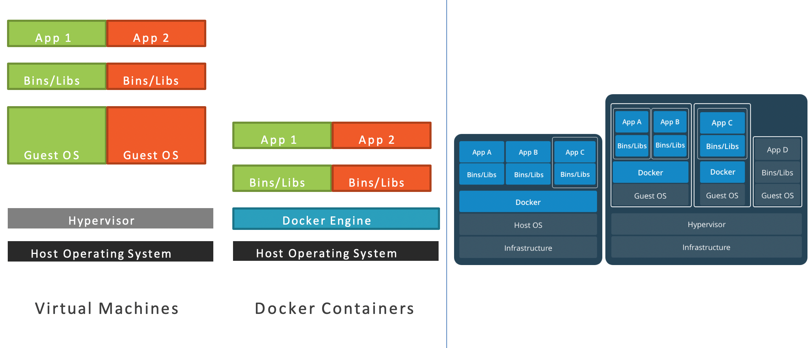

.. note::
    * Overview of docker vs. virtual machines, how they are different and how they are similar

----

:id: build-ship-run

Build, Ship, and Run
====================

.. image:: images/docker/build_ship_run.png
    :height: 640px
    :width: 1080px
    :align: center

.. note::
    * With docker, you build a container, and then push it to a registry where it is then available to be run. This process of building, shipping and running
        is an advanced workflow that cuts out the middlemen and allows developers to push code quickly and efficiently. 

----

:id: docker

Exercise 1 - docker
===================

Make a Change and then....

.. code:: python

    git clone git@github.com:mcgonagle/103.git

    docker build --tag=mcgonagle/103 . 
    
    docker run -it --rm -p "9000:9000" mcgonagle/103

    docker login

    docker push mcgonagle/103:latest

    docker run -it --rm -p "9000:9000" mcgonagle/103

.. note::
    * docker build, ship, and run workflow. This workflow has the student learning how to build a docker container from a Dockerfile, then shipping it to 
      their own personal docker hub registry account and then running the docker container. The intent of this exercise is to introduce and walk a student
      through the build, ship, run workflow of docker and capture learning that this is a new efficent way to build software. 

----

:id: where-we-have-between

Where we've been 
================

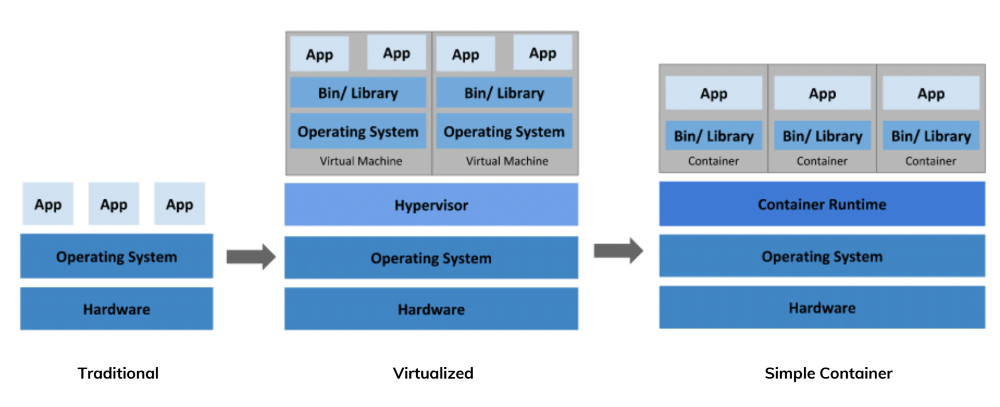

.. note::
    * We have been in a world where we craft single machines, single virtual machines and are migrating to a world where we have many many containers. 

----

:id: where-we-are-today

Where we are today
==================

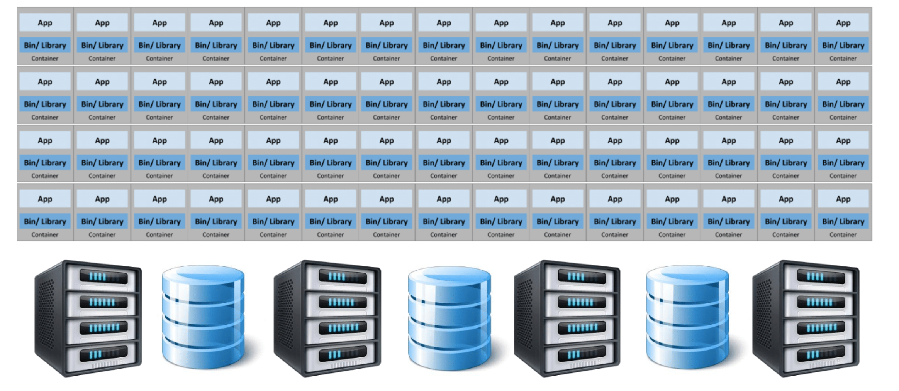

.. note::
    * A world where we have many many containers. What does this new complexity require? A management system for all of these containers. 

----

:id: container-challenges

Challenges
==========

* Scheduling containers across nodes
* Monitoring containers and workloads
* Scaling containers to rightsize for workloads
* Container communication and networking
* Service discovery and load balancing
* Storage management and orchestration
* Application deployments and rollbacks
* Secret and configuration management
* Scaling infrastructure and worker nodes

.. note::
    * An overview of the challenges of running containers. 

----

:id: what-is-kubernetes

What is Kubernetes?
===================

* Container orchestration system originally crated by Google for managing containerized workloads and services
* Based off of Google's proprietary Borg system which manages **2 billion containers per week**
* Currently the **fastest** growing open source project on the planet
* De facto cloud native operating system supported by all major cloud providers

.. note::
    * An overview of how kubernetes solves this many containers problem. 

----

:id: what-does-kubernetes-do

What does Kubernetes do?
========================

* Schedules containers across nodes and ensures containers are utilizing the underlying hardware 
* Provides a platform for contianer communication and networking across cluster_containers
* Service discovery and load balancing within a cluster
* Storage management and orchestration across nodes and cloud storage providers
* Application deployments and rollbacks
* Secret and configuration management
* Monitors container worklooads and restarts applications

.. note::
    * An overview of what kubernetes does. 

----

:id: five-core-kubernetes

5 Core Kubernetes Essential Concepts
====================================

* Pod 
* Deployment
* Service
* Ingress
* Namespace

.. note::
    * Five introductory to kubernetes concepts. 

----

:id: pod

Pod
===

* The basic deployable unit in Kubernetes
* 1+ (but tends to be just one) co-located and co-scheduled containers
* All containers in a pod share network and storage
* Can communicate over **localhost**
* Represents a single instance of an application
* Think of a pod as a **logical host** for an applciation's components

.. note::
    * Overview of a pod.

----

:id: deployment

Deployment
==========

* Allows you to manage pods in a declarative and upgradeable mannaer
* Note the "replicas" field that allows for scaling the number of pods
* Provide the ability to rollout changes and roll them back if necessary
* Different deployment strategies can be used

.. note::
    * Overview of a pod. 

----

:id: service

Service
=======

* Exposes one or many Pods via an internal IP address
* Also accessbile via cluster naming

    **{service}.{namespace}.svc.cluster.local**

    **nginx.webservice.svc.cluster.local**
* Service selects pods based on labels (in this case app=nginx)
* A Service mayb expose multiple ports

.. note::
    * Overview of a service. 

----

:id: ingress

Ingress
=======

* A Service is only accessible inside of the cluster
* An Ingress controller is used to expose a Service to the external world 
* Ingress maps hostnames and paths to internal services (think reverse proxy)
* The Ingress contoller is a loadbalancer that is forward requests based on rules

.. note::
    * Overview of Ingress. 

----

:id: namespace

Namespace
=========

* A Namespace is a logical isolation method
* Group logically similar workloads in a single namespace and enforce policies. For instance you can have one namespace per team
* Role Based Access Control (RBAC) can be used to control what users can do within a namespace
* You can limit the amount of cluster resources a namespace can use

.. note::
    * Overview of a namespace. 

----

:id: K8s

Exercise 2 - K8s
================

.. code:: python

    kubectl -n default run hundredthree --image=mcgonagle/103

    kubectl -n default expose deployment/hundredthree --port=9000 --target-port=9000

    kubectl -n default port-forward services/hundredthree 9000:9000

.. note::
    * You have built and shipped the 103 container in the previous exercise, now it is time to deploy it into your k8s single node cluster running inside
        the docker for desktop app. The above imperative commands push and then expose the 103 service to the local host making the container available 
        to the end user through kubernetes.

----

Exercise 2 cont. - K8s
======================

.. code:: python

    kubectl -n default delete service hundredthree

    kubectl -n default delete deployment hundredthree

.. note::
    * Steps to delete the service and the deployment. 

----

:id: K8s-manifests

Kubernetes Manifests
====================

.. note::
    * Transition slide for k8s manifests.

----

:id: K8s-namespace-manifest

Kubernetes Namespace Manifest
=============================

.. code:: python

    apiVersion: v1
    kind: Namespace
    metadata:
      name: mcgonagle  

.. note::
    * Declarative Namespace manifest

----

:id: K8s-deployment-manifest

Kubernetes Deployment Manifest
==============================

.. code:: python

    apiVersion: apps/v1
    kind: Deployment
    metadata:
      creationTimestamp: null
      labels:
        run: "103"
      name: "103"
      namespace: mcgonagle
    spec:
      replicas: 1
      selector:
        matchLabels:
        run: "103"
    strategy: {}
    template:
      metadata:
        creationTimestamp: null
        labels:
          run: "103"
    spec:
      containers:
      - image: mcgonagle/103
        name: "103"
        resources: {}
    status: {}

.. note::
    * Declarative Deployment manifest

----

:id: K8s-service-manifest

Kubernetes Service Manifest
===========================

.. code:: python

    apiVersion: v1
    kind: Service
    metadata:
      creationTimestamp: null
      labels:
        run: "103"
      name: "103"
    spec:
      ports:
      - port: 9000
        protocol: TCP
        targetPort: 9000
    selector:
      run: "103"
    status:
      loadBalancer: {}

.. note::
    * Declarative Service manifest

----

:id: K8s-loadbalancer-manifest

Kubernetes Loadbalancer Manifest
================================

.. code:: python

    apiVersion: v1
    kind: Service
    metadata:
      creationTimestamp: null
      labels:
        run: "103"
      name: hundredthree-0
      namespace: mcgonagle
    spec:
      ports:
      - port: 9000
        protocol: TCP
        targetPort: 9000
      selector:
        run: "103"
      type: LoadBalancer
    status:
      loadBalancer: {}

.. note::
    * Declarative Loadbalanancer manifest

----

:id: manifest-exercises

Exercise 3 - manifests
======================

.. code:: python

    git clone https://github.com/mcgonagle/103.git
    cd 103/manifests
    edit manifests namespaces.yml, deployment.yml and loadbalancer.yml 
    edit the namespace to reflect your last name

.. note::
    * Clone https://github.com/mcgonagle/103.git, edit the namespace.yml, deployment.yml, and loadbalancer.yml files to reflect a namespace for the student.

----

Exercise 3 cont. - manifests
============================

.. code:: python

    kubectl get ns --all-namespaces
    kubectl create -f namespace.yml
    kubectl get ns --all-namespaces

.. note::
    * run a get ns to see the namespaces available in the cluster. Then do a declarative create namespace with the manifest namespace.yml and then see what changed.

----

Exercise 3 cont. - manifests
============================

.. code:: python

    kubectl get deployment -n mcgonagle
    kubectl get pods -n mcgonagle
    kubectl create -f deployment.yml
    kubectl get deployment -n mcgonagle
    kubectl get pods -n mcgonagle

.. note::
    * Look at the pods and deployments and then run the manifest and then see what has changed. 

----

Exercise 3 cont. - manifests
============================

.. code:: python

    kubectl get services -n mcgonagle
    kubectl create -f loadbalancer.yml
    kubectl get services -n mcgonagle

.. note::
    * Look at the services and then install a LoadBalancer service and then look at what has changed. 

----

Exercise 3 cont. - manifests
============================

.. code:: python

    kubectl delete service hundredthree-0 -n mcgonagle
    kubectl delete deployment 103 -n mcgonagle

.. note::
    * Delete the LoadBalancer and the deployment.

----

:id: helm-overview

Helm Overview
=============

.. note::
    * transition slide

----

:id: what-is-helm

What is Helm?
=============

Helm is a package manager for K8s
---------------------------------

* Makes applications deployment easy, standardized and reusable
* Improves developer productivity
* Reduces deployment complexity
* Enhances operational readiness
* Speeds up adoption of cloud native apps

.. note::
    * Overview of Helm

----

:id: helm-exercises

Exercise 4 - helm
=================

.. code:: python

    kubectl -n kube-system create serviceaccount tiller

    helm init --service-account tiller --history-max 200 --upgrade

    cd helm

    helm install --dry-run --debug hundredthree

    helm install --debug hundredthree

    helm list

    helm delete --purge doltish-condor

.. note::
    * Helm Exercise that installs the service account for tiller into the docker-for-desktop k8s cluster, then installs tiller, then does a dry-run of an install
        then installs the hundredthree helm chart, and finally deletes. 

----

:id: spinnaker-overview

Spinnaker Overview
==================

.. note::
    * Transition Slide

----

:id: migrating-to-the-cloud

Migrating to the Cloud
======================

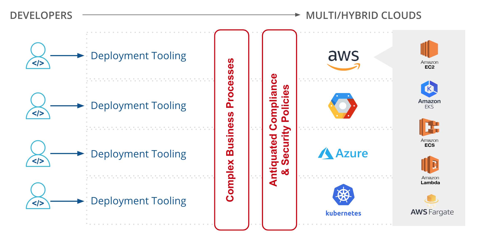

.. note::
    * Migration to the cloud is not easy. Especially in a multi-cloud world. AWS for example has hundreds of services. Developers have to contend with 
      complex tooling, complex processes and complex compliance. Life in multicloud world is not easy. 

----

:id: rigid-tooling

Rigid and Intertwined Tooling
=============================

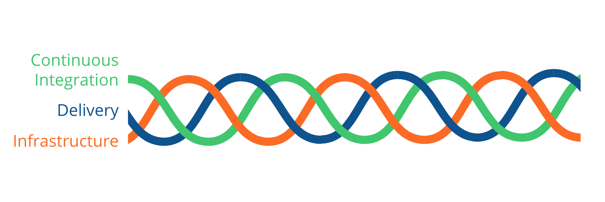

.. note::
    * To make matters worse the tooling for continuous integration, delivery, and infrastructure is all intertrwined and rigid. 

----

:id: unified-approach

A Unified Approach to Migrating
===============================

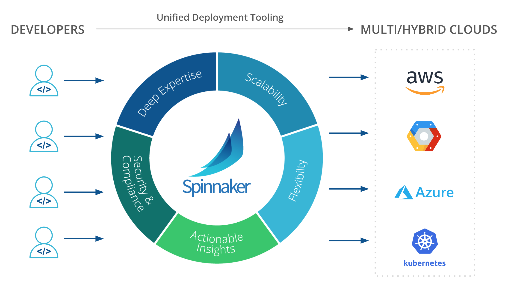

.. note::
    * Software delivery requires a unified approach to migration. Deep expertise, scalabilty, flexibility, insights and security are all aspects of Spinnaker.
      Creating a holistic tool set for developers on their multi cloud journey. 

----

:id: deploy-dependencies

Deploy without Dependencies
===========================

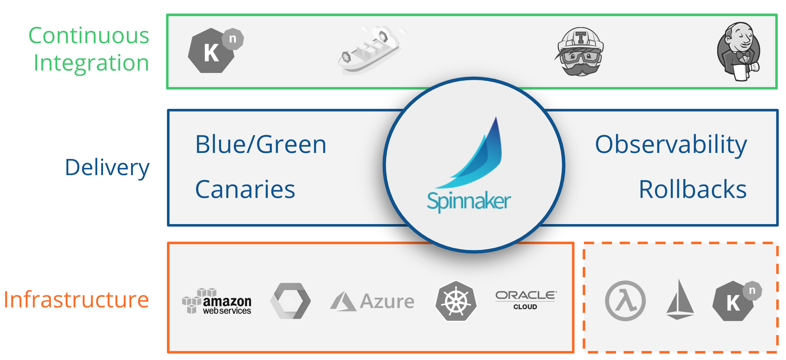

.. note::
    * The spinnaker tool unwinds deployment dependencies. It provides arbitrage to the various tools in the CI/CD pipeline acting as a man in the middle 
        providing a holistic one tool to rule them all. 

----

:id: single-pane-glass

Spinnaker is a Single Pane of Glass
===================================

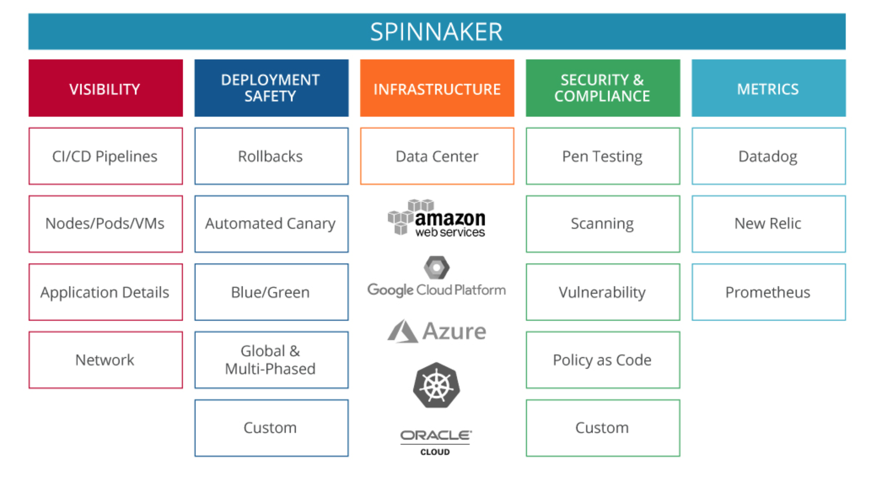

.. note::
    * Similar to its role as an arbitrator of complex tools, Spinnaker is a single pane of glass to observe and manage the visibiltiy, deployment, infrastructure
      security and compliance and metrics of your software delivery projects. 

----

:id: open-source

Spinnaker: The Open Source Standard 
===================================

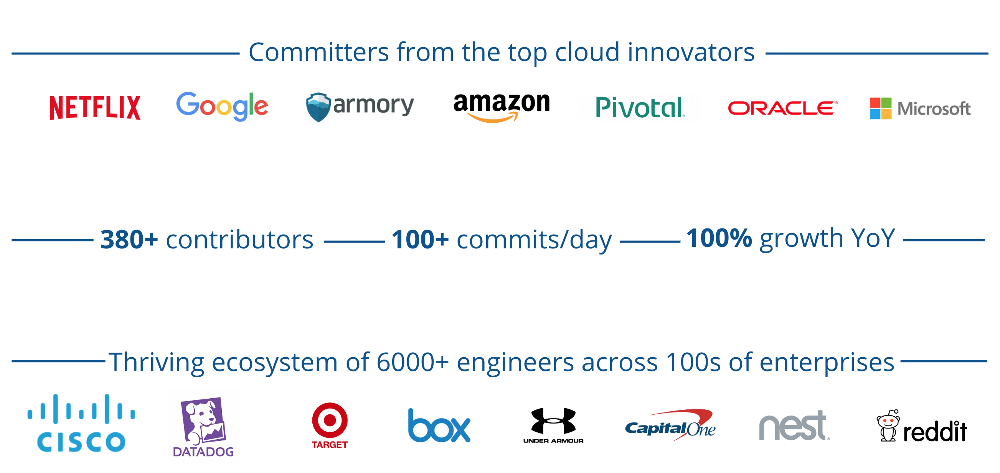

.. note::
    * Spinnaker is open source. It has committers from some of the top companies in the world. There are roughly 100 commits a day. Developers of spinnaker 
        are practicing continous delivery and experimentation. 

----

:id: pluggable

Spinnaker is a Pluggable, Cloud Native Platform 
===============================================

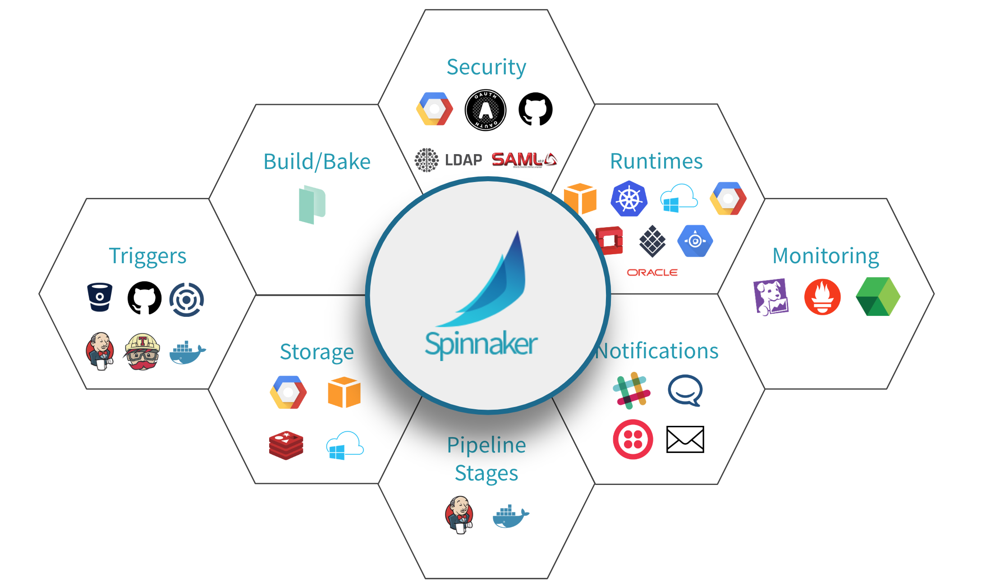

.. note::
    * Spinnaker is a cloud native app. Frankly, it is the microservice based app I was looking for to learn K8s. I needed something reasonalbly complex to 
        fully grasp cloud native architectures and k8s and spinnaker is a great app for understanding. 

----

:id: before-we-start

Before We Start...
==================

.. note::
    * note

----

:id: why-spinnaker

Why Spinnaker was created
=========================

* A brief history of Deployments at Netflix

* A need for end to end orchestration

*  When deploying to the cloud, your development platform should understand the cloud

.. note::
    * Asgard created an intuitive model for EC2 cloud-based applications that has made deployment and ongoing management of AWS resources easy. Everything required to produce a deployment artifact, in this case an AMI, has never been addressed in Asgard. Spinnaker, kicked off to enable end-to-end global Continuous Delivery at Netflix.
    * What Asgard didn’t have
    * This is why Spinnaker was built
    * The goals of this project were to create a Continuous Delivery platform that would:
        * enable repeatable automated deployments captured as flexible pipelines and configurable pipeline stages
        * provide a global view across all the environments that an application passes through in its deployment pipeline
        * offer programmatic configuration and execution via a consistent and reliable API
        * be easy to configure, maintain, and extend
        * be operationally resilient
        * provide the existing benefits of Asgard without a migration
 

----

:id: spinnaker-philosophy

Spinnaker Philosophy
====================

* Make all of your infrastructure immutable
* Make the deployment tool aware of infrastructure
* Minimize the possibility of errors in deployments
* Make deployments easy and repeatable
* When deployments fail, make it easy to roll back 
* Make it possible to deploy where you want, when you want 

.. note::
    * Immutable means there’s no chance of a failed config change
        * Changes are tested before they are deployed
        * You will always know the state of all your applications
    * Your platform should be smart enough to know what is going on with your infra at all times; no fire and forget
    * By automating the stages of your SDLC and defining them in a common tool deployments are always  done the way you intended
    * Related to last point, it should be easy to use.  For everyone.  You shouldn’t need special AWS, GCP, K8s knowledge to deploy.  You should be able to deploy.
    * Deployments sometimes go wrong. Spinnaker will catch it the problem is with the cloud, but when a bug slips through in the app being deployed it should take just a click to rollback
    * Spinnaker is always on, always ready to deploy. Your company may not be ready for 1,000 deployments a day and that’s OK, there are tools in Spinnaker to put up guard rails until you are ready a thousand, or even two thousand deployments a day.  You can get there!

----

:id: armory-adds

What Armory Adds
================

* Observability through the collection, correlation and presentation of data and metrics
* Enterprise class OSS software integration
* Pipeline as Code
* *Your* line into ongoing OSS development
* Experience running Spinnaker at scale

.. note::
    * Observability - Armory Lighthouse
    * Enterprise class OSS software - Terraform and Vault from Hashicorp
    * Pipelines - dinghy?
    * We are active developers, reviewer, and approvers
    *We have been working and hiring people with experience only surpassed by Netflix and Google - Enterprise support
    * Armory Installer
    * Pluggable Architecture
    * Armory Lighthouse
    * Bi-Weekly updates
    * Enterprise support
        https://www.armory.io/products/installed-spinnaker
    * Certified pipelines
    * SLA Dashboard

----

:id: terminology

Terminology
===========

* CI - Continuous Integration
* CD - Continous Delivery
* Continuous Deployment
* Pipeline - all stages of the SDLC
* ServerGroup - Spinnaker term for ASG/ReplicaSet
* Application - Collection of Related Apps
* Project - Collection of related Applications
* Stack - Anything that you want to be integrated together, i.e. environments

.. note::
    * note

----

:id: spinnaker-architecture

Spinnaker Architecture
======================

* 10 micro services
* Written in SpringBoot (Deck is Angular 1/ReactJS)
* Redis/SQL/(Cassandra)
* S3/GCS
* Kubernetes/AWS/GCP

.. note::
    * https://www.spinnaker.io/reference/architecture/
    * https://github.com/spinnaker/spinnaker.github.io/pull/1175
    * go through the flow
    * Life of a Deployment
    * Private external resources
        Redis, SQL, S3, GCS, Jenkins, etc

----

:id: spinnaker-diagram

Spinnaker Architecture
======================

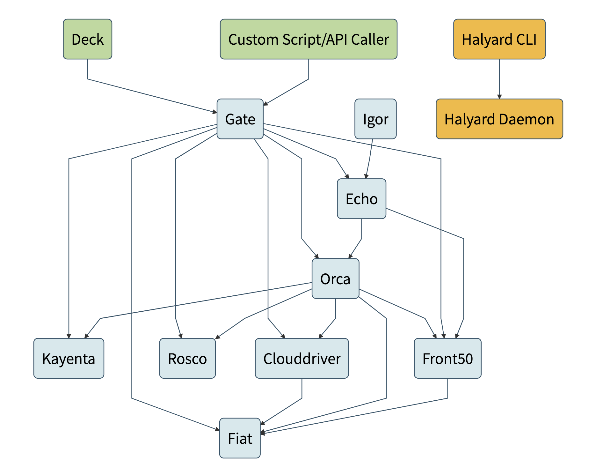

.. note::
    * note

----

:id: projects-applications

Projects & Applications
=======================

.. note::
    * Need to add a verbal walkthrough here of each Micro Service
        https://www.spinnaker.io/reference/architecture/
    * Deck:UI, Gate:API, Igor:Triggers, Echo:Eventing, Orca:Orchestion
    * Kayenta:Canarying, Rosco:Baking, Clouddriver:Cloud, Front50:persistent storage, Fiat: Authorization, 
    * Life of a Deployment
    * Private external resources
        Redis, SQL, S3, GCS, Jenkins, etc

----

:id: projects

Projects
========

What is a Project?
- A Collection of Applications

Think of this as your Product

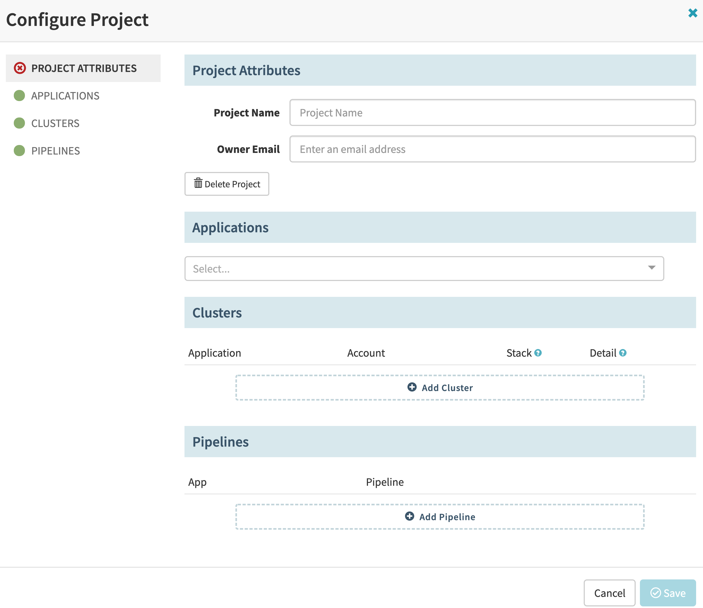

.. note::
    * Walk class through https://training.armory.io/#/search interface

----

:id: applications

Applications
============

Applications are deployable artifacts

Applications map to a single repo

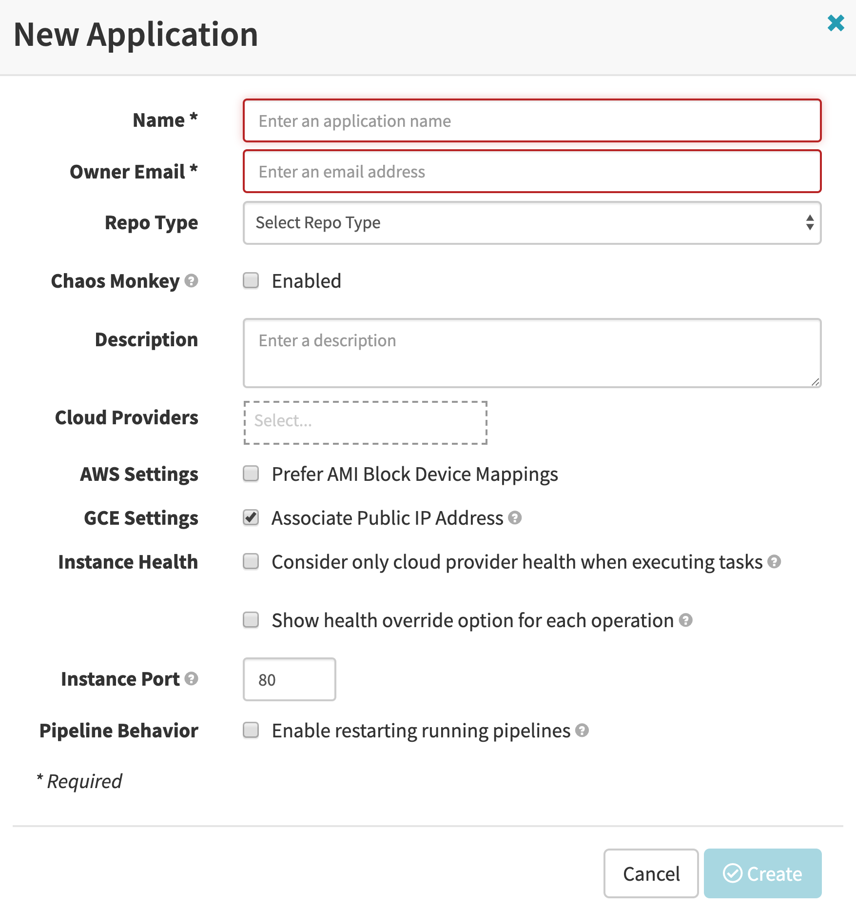

.. note::
    * AFTER TALKING THROUGH this go to the UI and show/demo
    * Menton that we will be doing an exercise after the demo

----

:id: introduction-to-pipelines

Introduction to Pipelines
=========================

.. note::
    * note

----

:id: creating-a-pipeline   

Creating a Pipeline
===================

Pipeline names are freeform

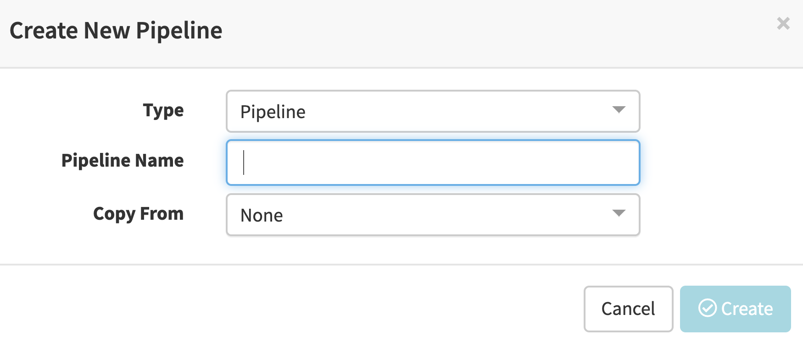

.. note::
    * pipeline - a series of stages
    * spaces in the name are OK
    * This is one of the only places where its OK

----

:id: pipeline-configuration

Pipeline Configuration
======================

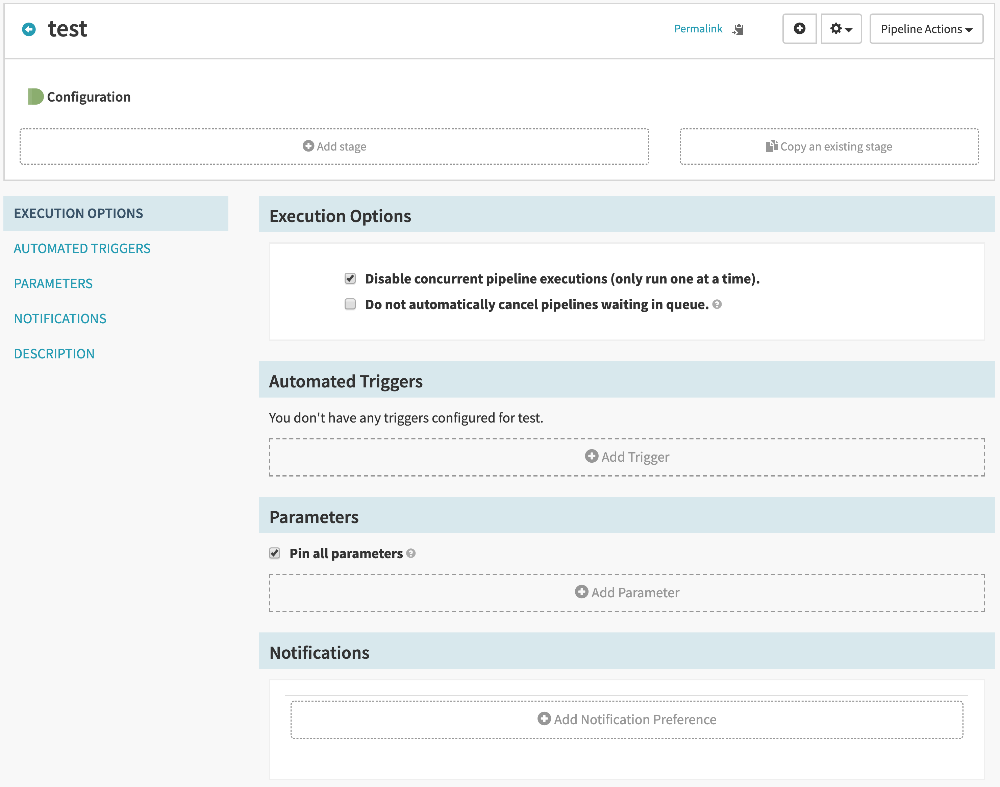

.. note::
    * Overview of each item.
    * Triggers up next.

----

:id: pipeline-triggers

Pipeline Triggers
=================

Triggers tell Spinnaker when to start a pipeline
    - Code Commits
    - CI Builds
    - New package or container versions
    - WebHooks
    - Scheduled
    - Other Pipelines

.. note::
    * This is a talk slide, explain all the possible triggers that can be used to start a pipeline.

----

:id: git-trigger

The Git Trigger
===============

It's just a webhook!
But its a special webhook.

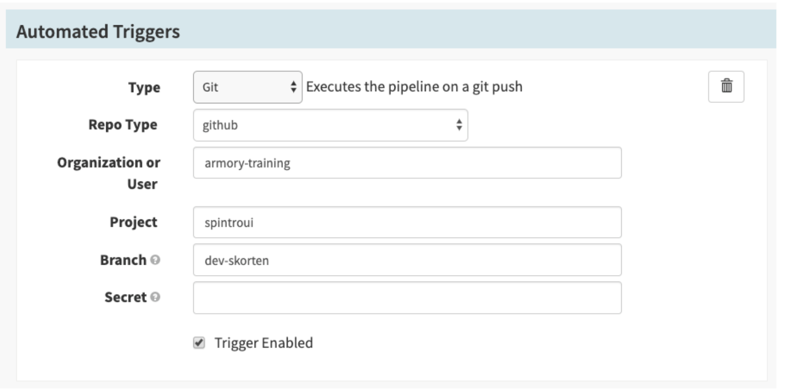

.. note::
    * Git trigger for GitHub, BitBucket, etc has the payloads already configured
    * If you use the WebHook trigger yo uwill have to define your own payloads
    * pub/sub you will have to define your payload and attribute constraints
    * pub/sub your ADMIN will have to add subscriptions - https://www.spinnaker.io/reference/halyard/commands/#hal-config-pubsub-google-subscription-edit

----

:id: stages-overview

Stages Overview
===============

Stages are automated steps of your SDLC
    - Software builds in your CI tool
    - Automated tests
    - Manual tests or judgments
    - Deployments
    - Scaling activities
    - Baking (creating) a new image
    - Evaulations
    - Wait stage
    - Much more...

.. note::
    * This is a talk slide, explain SOME of the possible stages, but not all (there’s too many options).
    * Stage is a logical orchestrated step in a pipeline, it does one thing.
    * That one thing can be comprised of multiple actions, in other words small tasks.
    * Touch on the differences in things like Deploy stage (aws vs k8s)
 

----

:id: wait-stage

Wait Stage
==========

Introduces an arbitrary wait
Why might we want this?

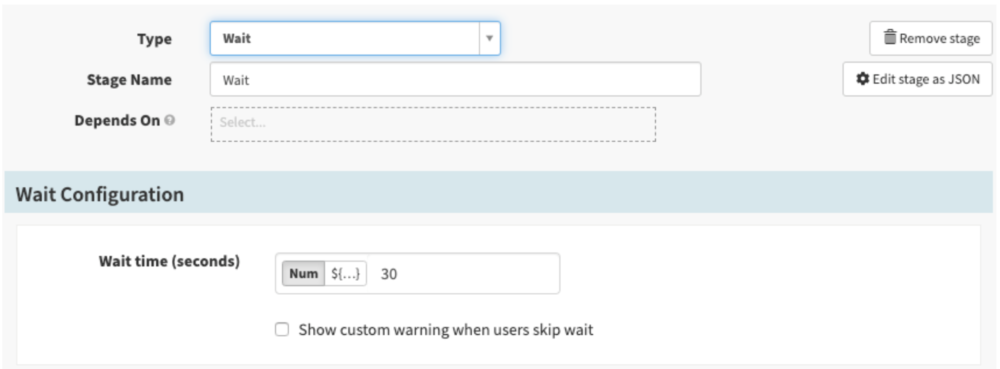

.. note::
    * Demo Slide
    * Wait for an application to warm up
    * Place holder in development for testing
    * Wait for something you don’t have a status on
    * To clean up branched pipeline visualization
    * Need to include specific use cases for the Wait stage here.

----

:id: manual-judgement-stage

Manual Judgment Stage
=====================

Use a Manual Judgment as a human gate to your next stage

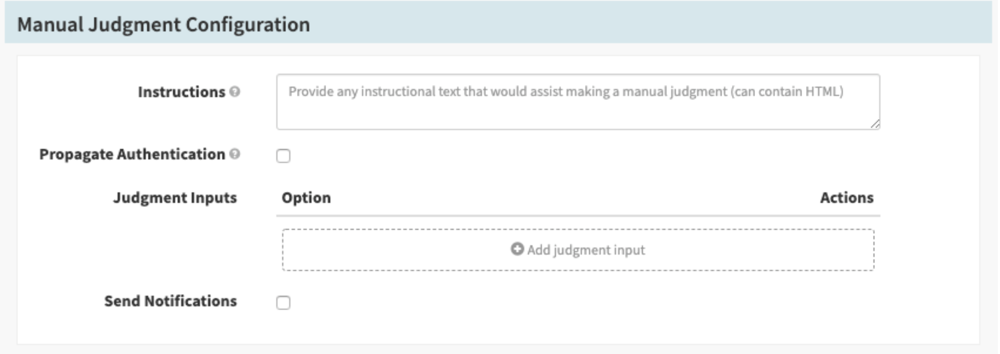

.. note::
    * Demo slide
    * Need to include specific use cases for the Manual Judgement stage here.
    * This is how you can get human approval for a deployment to proceed.
 

----

:id: execution-options

Execution Options
=================

These are common to all stages

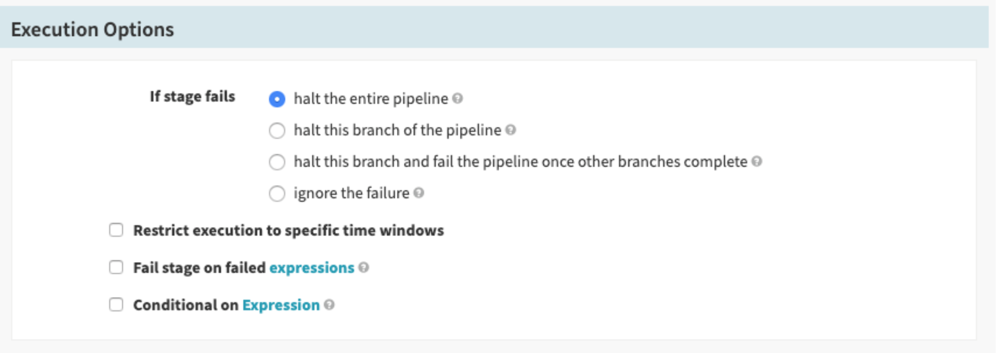

.. note::
    * Demo Slide
    * Need to include specific use cases for the different options.

----

:id: executing-a-pipeline

Executing a Pipeline
====================

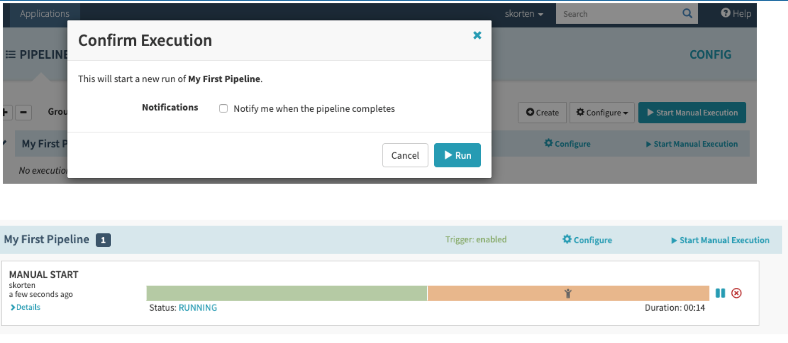

.. note::
    * Demo Slide
    * Talk about using the Git Trigger

----

:id: demo-working-github

Demo - Working with the GitHub UI
=================================

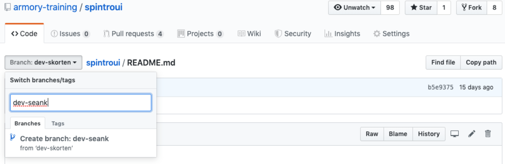

.. note::
    * Demo Slide
    * Walk through creating a branch, then updating/editing the README file from the UI

----

:id: exercise-4

Exercise 4 - To Edit
====================

1. Create a pipeline that promotes a manifest from dev to production
2. Create a pipeline that promotes a manifest to production in two clusters concurrenlty
3. Create a pipeline that promotes to two production clusters sequentially with a manual judgment
4. Create a pipeline that takes an action only if a condition is met

.. note::
    * note

----

:id: working-with-helm

Working with Helm
=================

Spinnaker surfaces a "Bake (Manifest)" stage to turn templates into manifests with the help of a templating engine. 

.. note::
    * This stage is intended to help you package and deploy applications that you own, and are actively developing and redploying frequently.
    * It is not intended to serve as a one-time installation method for third-party packages. If that is your goal, it's arguably 
      better to call *helm install* once when bootstrapping your kubernetes cluster. 

----

:id: helm-chart-artifacts

Helm Chart Artifacts
====================

.. note::
    * note

----

:id: baking-manifests

Baking Manifests
================

.. note::
    * note

----

:id: deploying-manifests

Deploying Manifests
===================

.. note::
    * note

----

:id: working-with-services

Working with Services
=====================

.. note::
    * note

----

:id: health-checks-kubernetes

Kubernetes Health Checks
========================

.. note::
    * note

----

:id: pipeline-strategies 

Pipeline Strategies
===================

.. note::
    * note

----

:id: promotional-pipelines 

Promotional Pipelines
=====================

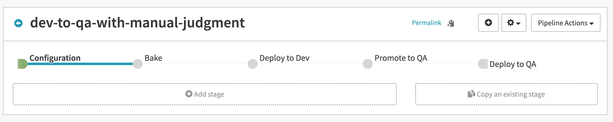

.. note::
    * note

----

:id: branching-pipelines 

Branching Pipelines
=====================

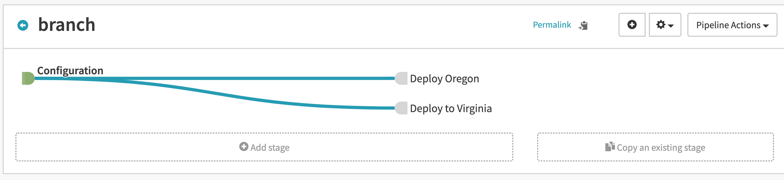

.. note::
    * note

----

:id: halting-pipelines 

Halting Pipelines
=================

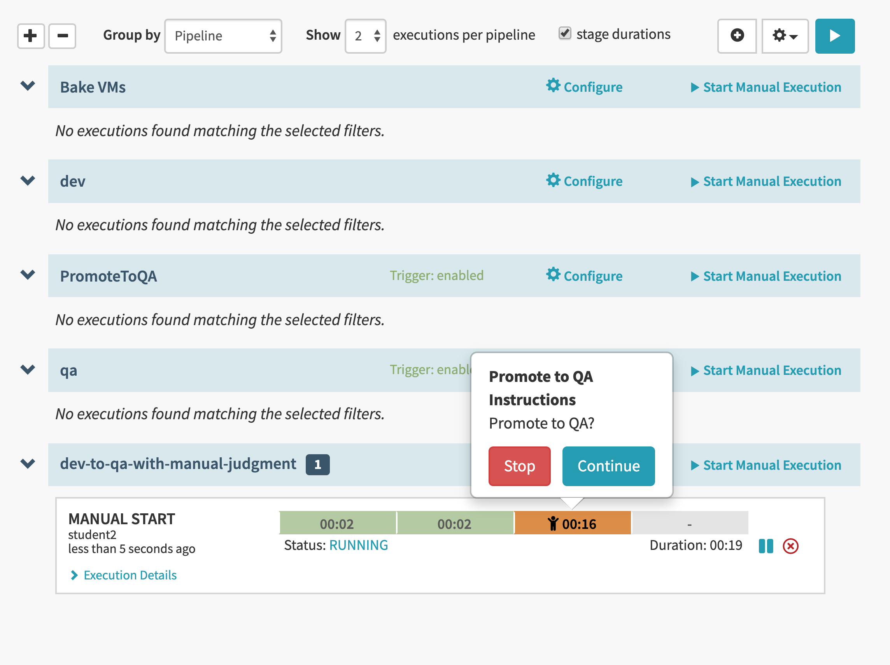

.. note::
    * note

----

:id: multicluster-pipelines 

Multi-Cluster Pipelines
=======================

.. note::
    * note

----

:id: spel-introduction

Spring Expression Language(SpEL) Introduction
=============================================

.. note::
    * note

----

:id: about-spel

About SpEL
==========

Add logic to pipelines

Used mostly to eval variables

    * Set vars from build systems
    * Pass image names between stages
    * Retrieve and eval manual judge responses

Can do much more

    * Embed java/groovy

.. note::
    * note

----

:id: spring-expressions

Spring Expressions
==================

What does a Spring Expression look like?

    * A shell variable

Where can I use them?

    * Any place in the UI where you can enter free-form text
    * In the "Edit Pipeline JSON" tool

When are they evaulated?

    * At stage execution time

Any exceptions?

    * Yes, can't use during pipeline configuration stage

.. note::
    * note

----

:id: expression-tool 

Expression Tools - Helper Functions
===================================

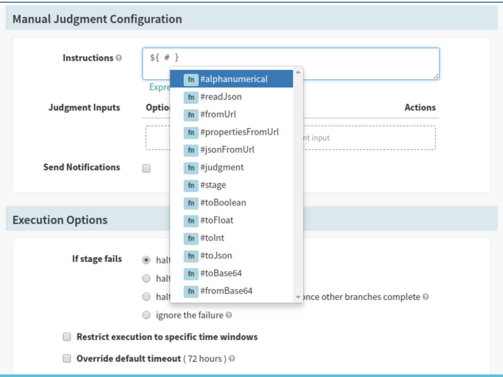

.. note::
    * note

----

:id: expression-tool-helper

Expression Tools - Helper Properties
====================================

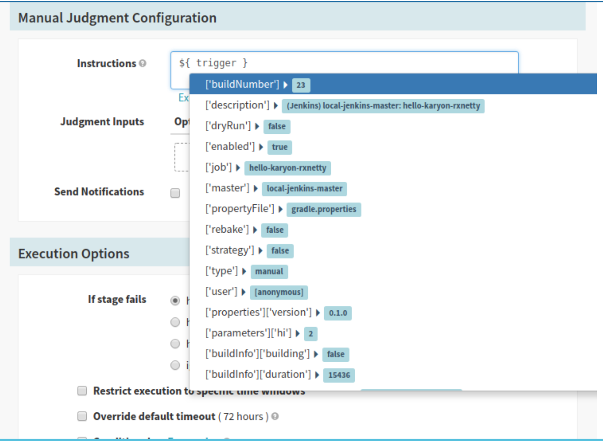

.. note::
    * note

----

:id: conditional-spel

Conditional SpEL
================

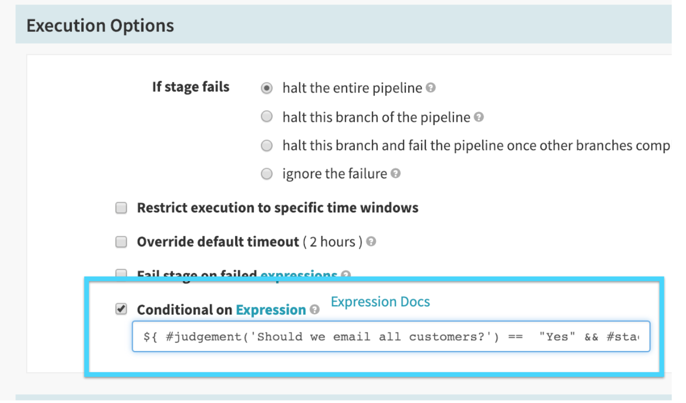

.. note::
    * note

----

:id: stateful-apps

Deploying Stateful Applications
===============================

.. note::
    * note

----

:id: debugging-pipelines

Debugging Pipelines
===================

.. note::
    * note

----

:id: debugging-bakes

Debugging Bakes
===============

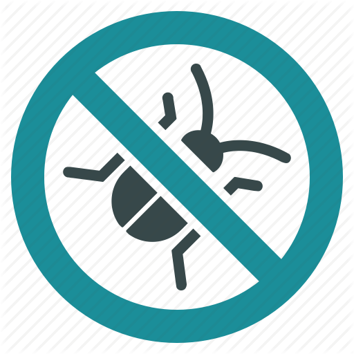

.. note::
    * note

----

:id: debugging-deployments

Debugging Deployments
=====================

.. note::
    * note

----

:id: exercise-3

Exercise 3
==========

1. Create a pipeline that takes an action only if a condition is met
2. Create a pipeline that deploys a stateful application, observe what happens when updated
3. Break a pipeline and debug it

.. note::
    * note

----

:id: questions

Questions?
==========

Presentation available at: https://github.com/mcgonagle/103

.. note::
    * note

----

:id: thank-you

Thank You Very Much!
====================
Thomas A. McGonagle
-------------------
Solutions Architect
-------------------
thomas.mcgonagle@armory.io
--------------------------
@mcgonagle
----------

.. note::
  * note